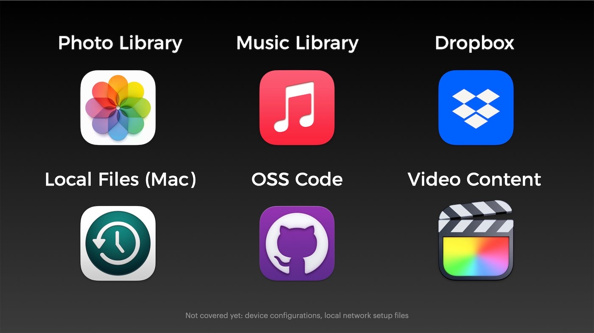
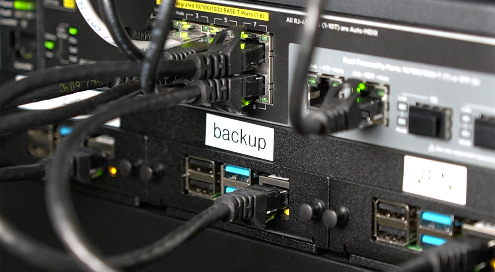

# My Backup Plan

This repository contains the scripts and explanation behind my personal backup strategy.

Every backup plan is unique, based on your risk assessment, the importance of the data being backed up, and budget (both in time and money).

This is mine, and I figured I'd go ahead and document everything publicly, because so many people ask about it.

Having a solid and multi-tiered backup plan gives you peace of mind and the freedom to not feel tied to any particular computer or 'sacred and precious backup drive' that has all your data stored on it.

I follow a variant of the 3-2-1 backup strategy, and have _at least_:


```
3 Copies of all my data
2 Copies on different storage media
1 Offsite copy
```

And for some of my data (like the contents of my Dropbox or iCloud Photos Library) I have 4 or 5 copies of the data!

## Video

I made a video about my backup plan in late 2021, you can watch it for a good overview:

[Backups: You're doing 'em wrong!](https://www.youtube.com/watch?v=S0KZ5iXTkzg) (YouTube, Dec 2021)

## Backup Strategy

I have a lot of data I care about, but to make sure I covered _everything_, I took a data inventory and grouped everything into six main categories:



I'll go through each type of data, and how I back it up:

### iCloud Photo Library

As of 2021, I store over 70,000 RAW images and home videos in my iCloud Photo Library. My primary local storage is on my desk Mac mini, which is set to 'Download Originals', which means an original copy of every RAW photo, iPhone photo and video, and home video I take is downloaded locally to the Mac mini's boot drive.

The library is over 1 TB in size, and growing, so at some point in the future, I may need to re-think this strategy, but it's been working for years, and simple is nice.

Since the remote backup requirement is taken care of by iCloud, and I have one complete copy locally, I rely on Time Machine to keep a second local copy of the entire library on my NAS.

I would love to use an open source media library system, but the extreme convenience of iCloud Photo Library makes it very difficult to downgrade to a less integrated solution.

(Though I still wish Aperture existed... Photos' editing and library organization tools are nowhere near as nice, and Lightroom is too janky for my entire library.)

### iCloud Music Library + iTunes Match

After managing a library of thousands of ripped songs and audiobooks for years, I finally decided to switch to Apple Music, for the convenience and family sharing.

I still do purchase and rip a lot of CDs—though mostly kids CDs these days so we can play back local and more obscure kids music artists in the van :)

All the songs are uploaded to my iCloud Music Library and/or matched through iTunes Match, and the entire music library is also stored locally on my Mac mini. It is backed up to the NAS via Time Machine, just like my photo library.

### Dropbox

I tend to be very organized when it comes to files like documents, guides, eBooks, spreadsheets, etc.

Therefore my tidy Dropbox has a very organized 20 GB of data inside, covering almost every computer file I've generated over the past few decades of life, going back to the old ClarisWorks essays I wrote on my old Mac in elementary school.

The Dropbox is mirrored on my two Macs, and is stored in the cloud at Dropbox. It is also backed up via Time Machine to my NAS, so technically I have four copies, one remote.

### Local Time Machine

My primary active data store is my M1 Mac mini, which is at my desk at home. It is on a UPS, and is accessible via VPN or via local network file sharing.

The entire machine is backed up via Time Machine to my NAS at least once an hour throughout the day, and I check the backup weekly to ensure nothing is stuck and new files are getting added.

I've relied on Time Machine since shortly after Apple introduced it.

The interface is kind of a time capsule of its own, seeing few updates since launch, but hey, it works, it's extremely unobtrusive, and the best thing: set and forget, basically.

Since all my primary data on the M1 mini is stored either in git repositories synced to GitHub, my Dropbox, or one of my iCloud libraries, I automatically have 1 remote copy, then I have a copy on at least my Mac mini and the Time Machine backup on the NAS.

### Open Source Code Repositories

Most of the data I rely on for my own income resides in a number of GitHub repositories. I _used_ to keep my local copies in Dropbox to make backups a little easier, but that has myriad issues, especially since Dropbox is ill-suited to replicate/sync giant working branches like the Linux kernel, which I work on here and there.

So now I keep a clone of all the GitHub repositories under the `geerlingguy` namespace locally, outside my Dropbox folder. And that's backed up to my NAS via Time Machine.

But there's a problem: I use GitHub as my 'source of truth' for all my open source code (and a few private repositories), and sometimes I merge PRs or do work on a different computer, so I can't rely on my Mac mini to always have the latest, up-to-date codebase.

So I run [Gickup](https://github.com/cooperspencer/gickup) on my backup server. Every week, it runs through all the repositories in my GitHub account, and clones them to a share on my NAS.

### Local network configuration

While almost every device and service I run in my house is managed via Ansible playbooks, which are tracked in code repositories on GitHub (which I've already covered), I also have some devices which are harder (or impossible) to configure via Ansible.

For these devices, I currently have either an automated script running to dump the device configuration into a NAS directory for all my configs, or I manually update the configuration backup file every once in a while (this is bad, but it's better than not having anything at all):

  - ASUSTOR NAS Settings (automated)
  - ASUS RT-AX86U Router settings (manual)
  - Pi-hole settings (manual)
  - Mikrotik CRS309-1G-8S Switch Settings backup (manual)
  - HP Aruba HP-2530-8G-PoEP Switch Settings backup (manual)

Follow the issue [#4 - Ensure other important infrastructure configuration is backed up](https://github.com/geerlingguy/my-backup-plan/issues/4) for more details on the automation of all these configuration backups.

### Video Content and NAS Shares

The most important data I have on my NAS, and thus the target of much of my effort around ensuring I have a solid backup and recovery plan, is my video project files.

For every video I create (for YouTube and elsewhere), I create a folder, create a separate Final Cut Pro library (with all media stored inside), and generate all assets, scripts, etc. inside that same directory.

I typically work on the video locally on my Mac mini until it's complete, relying on hourly Time Machine backups to store all the footage over on my NAS.

But once complete, I copy a datestamped project folder over to the NAS, and then eventually delete that project folder off my Mac. At that point, there is only one copy in existence, and that makes me nervous.



To help alleviate my nerves, I maintain two backups:

  1. A weekly script, [`backup.sh`](backup.sh), runs every Sunday night and synchronizes _all_ my video project data, as well as a number of other important-but-large directories of my data, to an AWS S3 Glacier Deep Archive bucket.
  2. A daily sync job sychronizes all the shared volumes from my primary NAS to a secondary local NAS.

In this way I always have two local copies (on my two online NASes), plus one offsite offline copy (on AWS Glacier Deep Archive). I used to just have one onsite copy and one offsite, but I learned the lesson of having a backup copy onsite when I accidentally deleted a video project folder once... and then had to wait a day or so to download it from Glacier.

But I'm happy with Glacier, because for a backup that's 8TB and growing, I only pay about $4/month for the storage. And especially with redundant NASes, it's only meant to be a truly emergency-level backup, and waiting a bit to save on cost is not a problem.

### Things I'm still working on

  - End-to-End encryption: Some backups and some transports are not fully encrypted. I'd like to change that.
  - Complete Disaster Recovery plans: Some backups have only been hand-checked, and I don't currently have a complete (and _tested_) plan for the restore process. Trying to recover data the first time in an emergency is a recipe for accidentally making things worse.

## `main.yml` - Ansible playbook to configure my Backup Pi

There's an Ansible playbook that installs all the backup software I use, configures shared filesystem mounts, and configures a backup cron job, all on a single 'Backup' Raspberry Pi. To run the playbook:

  1. Make sure you have Ansible installed.
  2. Copy `example.inventory.ini` to `inventory.ini` and `example.config.yml` to `config.yml`, and modify them according to your needs.
  3. Run `ansible-galaxy install -r requirements.yml`
  4. Run the playbook: `ansible-playbook main.yml`

### Manual `rclone` setup

For security purposes, I don't keep the entire `rclone` config in this repository. I could via Ansible Vault, but I don't. Sue me.

So after running the playbook, for `rclone` to actually work, you'll need to do the following manually, one time:

Run `rclone config` following the [S3 setup instructions](https://rclone.org/s3/#amazon-s3).

  - Set the remote name to `personal`.
  - Set the type of storage to `s3`.
  - Set the S3 provider to `AWS`.
  - For access credentials, I created a limited `rclone` user in AWS Console and have an access key set up for that user.
  - Set the region to `us-east-1`.
  - Set the ACL to `private`.
  - Set the storage class to `DEEP_ARCHIVE`.

Do all of this as the `pi` user (or whatever user you're going to configure to run the backups).

### Manual `gickup` setup

I also avoid keeping the entire `gickup` config in this repository. Sosumi.

After running the playbook, you'll need to add a Gickup config file named `~/.gickup.yml`, with contents as seen in top of the `gickup.sh` file.

You will also need to make sure an SSH key has been added to your GitHub account so the backup server can access GitHub, and you should create a Personal Access Token and paste the token where indicated.

Do all of this as the `pi` user (or whatever user you're going to configure to run the backups).

## `backup.sh` - Rclone to S3 Glacier Deep Archive

You can manually run `backup.sh` the first time and watch it do its magic:

```
pi@backup:~ $ ./backup.sh 
```

The initial backup could take a while—mine took over two weeks :)

Caveats with Glacier Deep Archive:

  1. You can't easily move objects around inside the bucket. So don't just dump stuff into Deep Archive that's going to move around a lot, especially very large files that would need a re-upload or to be downloaded then moved.
  2. Retrieval takes time—at least 12 hours _just to restore an object to your Bucket so you can start downloading it_. There is no 'expedited' option with Deep Archive.

## `gickup.sh` - Synchronize GitHub repositories to NAS

You can manually run `gickup.sh` the first time and watch it do its magic:

```
pi@backup:~ $ ./gickup.sh 
```

The initial clone of all repositories takes an hour or two, but once complete, re-syncs should only take a few minutes, as it only fetches and pulls, and doesn't have to re-clone each repo.

Caveats with Gickup:

  1. You can't currently have Gickup prune repos that were deleted in the GitHub account.
  2. Cloning large repos (multiple GB) will cause the OOM killer to kill the process if running on a lower-memory Pi.

## Retriving content from S3 Glacier Deep Archive

**For individual file retrieval**, see: [Retrieving individual files from S3 Glacier Deep Archive using AWS CLI](https://www.jeffgeerling.com/blog/2021/retrieving-individual-files-s3-glacier-deep-archive-using-aws-cli)

**For entire directory restore**, see: TODO.

## Backup Security

TODO: Explain how I keep my backup data secure and free from prying eyes. Also the different 'tiers' of data (in terms of importance of things like encryption).

## Author

This project is maintained by [Jeff Geerling](https://www.jeffgeerling.com), author of [Ansible for DevOps](https://www.ansiblefordevops.com).
